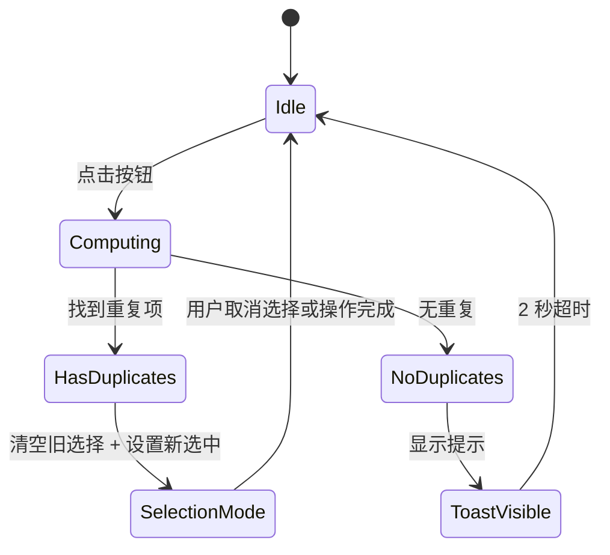

# SPEC：工具栏"选择重复标签"功能

## 1. 文档信息

| 字段 | 内容 |
| --- | --- |
| 文档名 | `SPEC.md` |
| 需求主题 | 顶部操作栏新增"选择重复标签"按钮 |
| 当前状态 | 已完成访谈确认 |
| 影响范围 | 侧边栏 `types.ts`、`normalizeTab.ts`、`tabState.ts`、`App.tsx`、`SidepanelToolbar.tsx`、`i18n.ts`、`SidepanelStatus.tsx`（Toast） |
| 技术栈 | `React` **（前端组件框架）** + `TypeScript` **（带类型约束的 JavaScript）** + `Chrome Extension` **（Chrome 浏览器扩展）** |
| 参考入口 | [src/sidepanel/SidepanelToolbar.tsx](src/sidepanel/SidepanelToolbar.tsx)、[src/sidepanel/App.tsx](src/sidepanel/App.tsx)、[src/shared/types.ts](src/shared/types.ts)、[src/shared/domain/normalizeTab.ts](src/shared/domain/normalizeTab.ts) |

---

## 2. 背景与目标

当前侧边栏已经能显示所有窗口的标签，并支持手动多选（Shift 范围选、Ctrl 切换选）后进行批量关闭或移动。

但用户经常会在多个窗口中打开**相同的网页**（比如重复打开了多个 Gmail、多个 GitHub PR 页面），手动查找和选中这些重复标签非常繁琐。

本次需求解决：

> 在顶部操作栏增加一个按钮，点击后自动扫描所有窗口的标签，**将重复的标签页选中**，每组重复只保留 1 个不选（保留最近活跃的那个），并自动进入选择模式以便用户批量操作。

### 2.1 本次目标

| 编号 | 目标 |
| --- | --- |
| G1 | 提供"一键选择所有重复标签"的入口 |
| G2 | 每组重复 URL 保留最近活跃的 1 个不选，避免误关正在用的页面 |
| G3 | 单击后自动进入选择模式，用户可立即批量关闭/移动 |
| G4 | 无重复时给出轻量正向反馈（Toast 提示） |

### 2.2 本次不做

| 编号 | 不做内容 |
| --- | --- |
| NG1 | 不做右键菜单或标签行级"选择此标签的重复项"入口 |
| NG2 | 不添加排除规则（内部页面、空白页等全部参与检测） |
| NG3 | 不设最大选中数量保护 |
| NG4 | 不新增键盘快捷键 |
| NG5 | 不改变已有选择模式的交互逻辑 |

---

## 3. 术语定义

| 术语 | 定义 |
| --- | --- |
| 重复标签 | 完整 URL **（协议 + 域名 + 路径 + 查询参数 + hash）** 完全一致的两个或多个标签 |
| 保留一个 | 每组重复标签中，`lastAccessed` **（Chrome 原生记录的上次活跃时间戳）** 最大的标签保留不选，其余均被选中 |
| 选择模式 | 侧边栏已有的多选模式，顶栏显示"已选 N 项"及"关闭已选"等批量操作按钮 |
| Toast | 出现在状态区域、短暂显示后自动消失的提示条 |

---

## 4. 访谈后确认的决策

| 主题 | 最终口径 |
| --- | --- |
| 触发入口 | **顶部操作栏新增按钮** |
| 按钮图标 | `Intersection` **（两个重叠的圆，来自 @icon-park/react）** |
| 按钮位置 | 工具栏主操作区，排序参考上下文 |
| 重复判定标准 | **严格完整 URL 匹配** |
| 检测范围 | **跨窗口全局**（所有浏览器窗口） |
| 保留策略 | 每组保留 `lastAccessed` **最新的那个**不选 |
| 固定标签（pinned） | **跳过**，不参与检测 |
| 与现有选择交互 | **清空旧选择**，重新计算新选中 |
| 是否自动进入选择模式 | **是** |
| 无重复时的反馈 | **Toast 提示**，短暂显示"未发现重复标签" |
| 数量保护 | **无限制** |
| 排除规则 | **无排除**（所有非 pinned 标签一视同仁） |

---

## 5. 用户流程

```mermaid
flowchart TD
    A[用户点击工具栏 "选择重复标签" 按钮] --> B{遍历所有标签，按 URL 分组}
    B --> C{是否有 URL 出现次数 > 1 的组}
    C -->|否| D[显示 Toast "未发现重复标签"]
    D --> E[结束，不进入选择模式]
    C -->|是| F[清空当前已有选中状态]
    F --> G[逐组处理重复标签]
    G --> H[过滤掉 pinned 标签]
    H --> I[组内按 lastAccessed 降序排列]
    I --> J[保留第 1 个（最新活跃）不选]
    J --> K[其余全部加入选中集合]
    K --> L{还有下一组吗}
    L -->|有| G
    L -->|无| M[进入选择模式]
    M --> N[Toolbar 显示 "已选 N 项"及批量操作按钮]
    N --> O[结束，用户可批量关闭/移动]
```

---

## 6. 功能规格

### 6.1 顶部操作栏

| 编号 | 规则 |
| --- | --- |
| FR-01 | 在 [src/sidepanel/SidepanelToolbar.tsx](src/sidepanel/SidepanelToolbar.tsx) 中新增"选择重复标签"按钮 |
| FR-02 | 图标使用 `Intersection` **（@icon-park/react 内置图标，两个重叠的圆）** |
| FR-03 | 按钮位于主操作区，**紧随 "选择"（ListCheckbox）按钮之后、"重新同步"之前**（按功能优先级：选择类操作 → 同步类操作） |
| FR-04 | 当工具栏整体不可交互时，按钮跟随现有工具栏一起禁用 |
| FR-05 | 可用时悬浮提示：中"选择重复标签"/英"Select duplicate tabs" |
| FR-06 | 禁用时悬浮提示：中"正在同步，请稍后"/英"Syncing, please wait" |

### 6.2 重复检测算法

| 编号 | 规则 |
| --- | --- |
| FR-07 | 数据源为当前 `snapshot.tabsById` **（标签快照）**，遍历所有窗口的所有标签 |
| FR-08 | 每个标签以 `tab.url` 作为分组 key，**完整 URL 严格匹配** |
| FR-09 | `tab.pinned === true` 的标签**跳过**，不参与分组 |
| FR-10 | 分组后，仅保留 `count > 1` 的组（即有重复的组） |
| FR-11 | 若没有任何分组满足 `count > 1`，视为"无重复" |
| FR-12 | 对每个重复组，按 `lastAccessed` **降序**排列 |
| FR-13 | 排序后的第 1 个（`lastAccessed` 最大，即最近活跃的）**保留不选** |
| FR-14 | 同组其余标签全部列入选中集合 |
| FR-15 | 若两个标签 `lastAccessed` 相同（极端情况），取 `tab.id` 较大的保留（较新创建的 tab） |

### 6.3 点击行为

| 编号 | 规则 |
| --- | --- |
| FR-16 | 点击按钮时，**立即**执行重复检测与选中 |
| FR-17 | 先清空已有选择（调用 `clearSelection()`） |
| FR-18 | 再设置新选中集合，自动进入选择模式 |
| FR-19 | 如果已在选择模式中且已有选中项，**同样清空后重新计算** |
| FR-20 | 选中后**不自动滚动**列表（用户可能想留在当前位置） |
| FR-21 | 选中后**不展开折叠的窗口或分组**（用户可手动展开） |

### 6.4 无重复反馈

| 编号 | 规则 |
| --- | --- |
| FR-22 | 检测无重复时，**不清空已有选择**（避免中断用户当前操作） |
| FR-23 | 在 `SidepanelStatus` 区域显示 Toast：中"未发现重复标签"/英"No duplicate tabs found" |
| FR-24 | Toast 持续时间 **2 秒**，自动消失 |
| FR-25 | Toast 不阻挡用户交互，纯文字提示，无图标 |

### 6.5 选择状态规则

| 编号 | 规则 |
| --- | --- |
| FR-26 | 选择重复后，Toolbar 显示 "已选 N 项" |
| FR-27 | 选中后用户可正常使用已有批量操作：关闭已选、移动到新窗口 |
| FR-28 | 选中后用户可通过点击空白区域或按 Esc 取消选择 |
| FR-29 | **不会**因为选中重复项而触发任何关闭或移动操作 |

---

## 7. 方案取舍

| 方案 | 结论 | 原因 |
| --- | --- | --- |
| 使用 `chrome.tabs.query` **直接在侧边栏中实时查询** | 不采用 | 已有 snapshot，额外 API 调用造成不一致风险 |
| 用 tab ID 递增作为"保留"依据 | 不采用 | 不满足"保留最近活跃的"的用户需求 |
| `lastAccessed` **加入数据模型** | 采用 | Chrome API 原生提供此字段，只需透传即可 |
| 使用右键菜单触发 | 不采用 | 用户选择了工具栏按钮方案 |

---

## 8. 技术设计

### 8.1 需要新增 `lastAccessed` 字段

`TabRecord` **当前缺少** `lastAccessed`，需要透传 Chrome 原生 `tabs.Tab.lastAccessed`。

**影响范围**：

| 文件 | 改动 |
| --- | --- |
| [src/shared/types.ts](src/shared/types.ts) | `TabRecord` **新增** `lastAccessed: number` |
| [src/shared/domain/normalizeTab.ts](src/shared/domain/normalizeTab.ts) | `normalizeChromeTab()` **中新增** `lastAccessed: tab.lastAccessed ?? 0` |
| [src/shared/domain/tabState.ts](src/shared/domain/tabState.ts) | `isSameTab()` **中增加** `lastAccessed` **比较** |

改完后端数据类型后，侧边栏 snapshot 中就会包含 `lastAccessed`，前端可直接在 App 层计算重复选择。

### 8.2 现有代码基础

| 现有位置 | 已有能力 | 本次用途 |
| --- | --- | --- |
| [src/sidepanel/SidepanelToolbar.tsx](src/sidepanel/SidepanelToolbar.tsx) | 渲染顶部操作栏与悬浮提示 | 新增重复选择按钮 |
| [src/sidepanel/App.tsx](src/sidepanel/App.tsx) | 汇总选择状态与命令分发 | 承接重复检测计算与选中设置 |
| [src/sidepanel/useTabSelection.ts](src/sidepanel/useTabSelection.ts) | 维护选择模式、选中集合 | 复用 `clearSelection()` 和 `setSelectedTabIds` |
| [src/sidepanel/SidepanelStatus.tsx](src/sidepanel/SidepanelStatus.tsx) | 显示加载/错误/调试状态 | 新增 Toast 提示区 |
| [src/shared/i18n.ts](src/shared/i18n.ts) | 维护中英文文案 | 新增按钮名、提示文案 |

### 8.3 重复检测纯函数

在 `App.tsx` 中新增或提取一个**纯函数**（无副作用，便于测试）：

```typescript
interface DuplicateSelectionResult {
  tabIdsToSelect: number[];  // 需要选中的标签 ID（每组保留 1 个之外的全部）
  hasDuplicates: boolean;    // 是否有重复
}

function computeDuplicateSelection(
  tabsById: Record<number, TabRecord>,
  windowTabIds: Record<number, number[]>
): DuplicateSelectionResult;
```

**算法步骤**：

1. 遍历所有 `windowTabIds` 收集标签 ID
2. 过滤掉 pinned 的标签
3. 以 `tab.url` 为 key 分组
4. 筛选出 `count > 1` 的组
5. 对每组按 `lastAccessed` 降序排列，若相同取 `tab.id` 较大者
6. 每组取 `[1..n]` **（排除索引 0）** 加入 `tabIdsToSelect`
7. 返回结果

### 8.4 App.tsx 中的点击处理

| 步骤 | 动作 | 说明 |
| --- | --- | --- |
| 1 | 从 snapshot 读取 `tabsById` + `windowTabIds` | 当前快照数据 |
| 2 | 调用 `computeDuplicateSelection()` | 纯函数计算 |
| 3 | 若无重复 | 设置 Toast 状态 → 显示提示 → 2 秒后清除 |
| 4 | 若有重复 | 调用 `clearSelection()` → 调用 `setSelectedTabIds(result.tabIdsToSelect)` → `enterSelectionMode()` |
| 5 | 记录 trace 事件 | `panel/duplicates-selected` |

### 8.5 Toast 实现策略

**不引入 Toast 库**，利用现有 `SidepanelStatus` **状态区域的插入能力**，在状态区下方增加一个极简的 `div`：

```tsx
// App.tsx
const [duplicateToast, setDuplicateToast] = useState<string | null>(null);

useEffect(() => {
  if (!duplicateToast) return;
  const timer = setTimeout(() => setDuplicateToast(null), 2000);
  return () => clearTimeout(timer);
}, [duplicateToast]);

// 传给 SidepanelStatus
<SidepanelStatus ... duplicateToast={duplicateToast} />
```

**Toast 样式约束**：

| 属性 | 值 |
| --- | --- |
| 定位 | 静态流内（不脱离文档流，不 absolute/fixed） |
| 背景色 | 极浅灰色或透明背景 |
| 字号 | 与 SidepanelStatus 正文一致（12px） |
| 动画 | 无动画，直接显示/隐藏 |
| 交互阻挡 | 不阻挡（`pointer-events: none`） |

### 8.6 按钮重新启用检测

按钮不需要额外禁用逻辑，复用现有 `disabled` 属性（当 toolbar 整体不可交互时禁用）。

无需实时检测"是否有重复"来动态禁用按钮。按钮始终可点，点击后执行检测，无重复时显示 Toast。

### 8.7 事件追踪

| 事件名 | 触发时机 | 携带数据 |
| --- | --- | --- |
| `panel/duplicates-selected` | 检测到重复并选中 | `{ duplicateCount: number, selectedCount: number, urlGroupCount: number }` |
| `panel/duplicates-none` | 未检测到重复 | `{}` |

---

## 9. 状态图



---

## 10. 边界情况

| 场景 | 预期行为 |
| --- | --- |
| 所有标签 URL 都唯一 | Toast 提示"未发现重复标签"，已有选择保持不变 |
| 某组重复中 pinned 标签占多数 | pinned 标签不参与，仍然对非 pinned 的重复进行选中 |
| 某组重复中只有一个非 pinned 标签 | 该组不产生选中（因为 need `count > 1`） |
| 用户已选中一些标签后点击按钮 | 清空已有选中，重新计算重复选中 |
| 用户正在选择模式中点击按钮 | 同上，清空后重新选中 |
| 浏览器标签数量极大（几百个） | 计算在 `useMemo` **或 `useCallback` 中即时完成，无额外缓存** |
| 某个标签 URL 为空字符串 | 空 URL 不会和其他标签重复（除非多个标签都是空 URL），正常参与分组 |
| 所有标签都是 pinned | 无重复，显示 Toast |
| 快速连续点击按钮 | 每次点击独立计算，前一次的选中被后一次覆盖 |
| `lastAccessed` 为 0（Chrome 解析失败） | 当作"最不活跃"处理，排在最后，会被选中 |

---

## 11. 文案需求

### 11.1 新增文案键

| 文案键 | 简体中文 | English |
| --- | --- | --- |
| `sidepanel.toolbar.selectDuplicates` | 选择重复标签 | Select duplicate tabs |
| `sidepanel.toolbar.selectDuplicates.disabled` | 正在同步，请稍后 | Syncing, please wait |
| `sidepanel.toast.noDuplicates` | 未发现重复标签 | No duplicate tabs found |

### 11.2 文案规则

| 场景 | 展示文案 |
| --- | --- |
| 按钮可用，悬浮提示 | `sidepanel.toolbar.selectDuplicates` |
| 按钮禁用，悬浮提示 | `sidepanel.toolbar.selectDuplicates.disabled` |
| 无重复时的 Toast | `sidepanel.toast.noDuplicates` |

---

## 12. 样式约束

| 项目 | 约束 |
| --- | --- |
| 新按钮风格 | 必须复用现有顶部操作栏按钮外观体系（`icon` + `outline` theme，18px） |
| Intersection 图标 | 使用 `@icon-park/react` 的 `Intersection` 组件，`theme="outline"` `size="18"` |
| Toast 样式 | 纯文字，无背景框/无图标/无动画，直接显示/隐藏 |
| 性能要求 | 重复检测使用纯函数，不触发额外渲染循环 |

---

## 13. 测试规格

### 13.1 单元测试

| 测试文件 | 覆盖重点 |
| --- | --- |
| `tests/tabSelection.test.ts` | `computeDuplicateSelection()` **纯函数**的 4 类场景 |
| `tests/sidepanelToolbar.test.tsx` | 新按钮渲染、图标、悬浮提示 |

### 13.2 computeDuplicateSelection 测试用例

| 用例 | 输入 | 预期输出 |
| --- | --- | --- |
| 正常路径 | 5 个标签，2 组重复 | 选中 3 个（2+1-2），hasDuplicates=true |
| 无重复 | 5 个标签全部 URL 唯一 | 选中 0 个，hasDuplicates=false |
| 全部 pinned | 5 个标签全部 pinned | 选中 0 个，hasDuplicates=false |
| 混合 pinned | 3 个重复，其中 1 个 pinned | pinned 不参与，选中 1 个 |
| 空数据 | 空 `tabsById` | 选中 0 个，hasDuplicates=false |
| lastAccessed 排序 | 同 URL 3 个，lastAccessed 不同 | 保留 lastAccessed 最大的，选中其余 2 个 |

### 13.3 集成测试

| 测试文件 | 覆盖重点 |
| --- | --- |
| `tests/App.test.tsx` | 点击按钮后选择状态变化 |
| `tests/App.test.tsx` | 无重复时 Toast 显示与消失 |
| `tests/App.test.tsx` | 重复选中后进入选择模式，toolbar 显示"已选 N 项" |

### 13.4 验收清单

| 编号 | 验收项 |
| --- | --- |
| AC-01 | 顶部操作栏出现"选择重复标签"按钮，使用 Intersection 图标 |
| AC-02 | 点击后自动选中所有非 pinned 的重复标签（跨窗口） |
| AC-03 | 每组重复保留最近活跃的 1 个不选 |
| AC-04 | 无重复时弹出 Toast"未发现重复标签"，2 秒后自动消失 |
| AC-05 | 无重复时不清空已有选择 |
| AC-06 | 选中后自动进入选择模式，可批量关闭/移动 |
| AC-07 | 与现有 Shift/Ctrl + 点击选择互不干扰 |
| AC-08 | pinned 标签不参与检测 |

---

## 14. 最终结论

本需求的最佳实现方式是：

> 在 `TabRecord` **中透传** Chrome 原生 `lastAccessed` **字段**，前端点击按钮时使用纯函数 `computeDuplicateSelection()` 计算重复项，**每组保留最近活跃的一个**，其余自动选中并进入选择模式。无重复时通过极简 Toast 反馈。

改动涉及以下 5 个方面：

1. **后端数据类型**透传（3 个文件，字段级改动）
2. **前端新增按钮**（`SidepanelToolbar.tsx`）
3. **前端新增重复检测纯函数**（`App.tsx` 内或独立 `selectors`）
4. **前端新增 Toast**（`SidepanelStatus.tsx` 扩展）
5. **中英文文案**（`i18n.ts`）

不改变任何现有交互，不新增后台协议，不修改现有 `tabSelection.ts` 的选择引擎。
