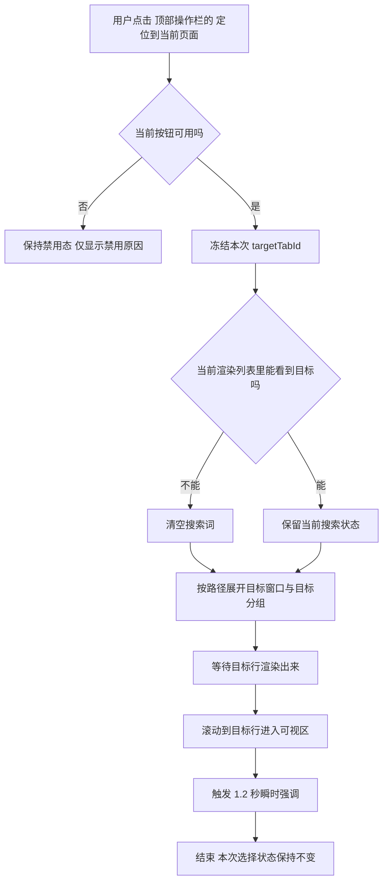
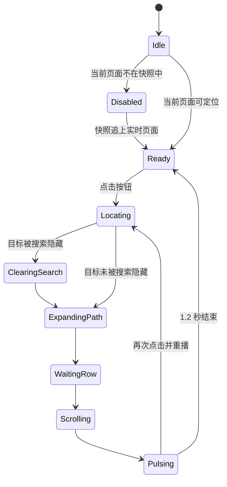

# SPEC：顶部操作栏新增“定位到当前页面”

## 1. 文档信息

| 字段 | 内容 |
| --- | --- |
| 文档名 | `SPEC.md` |
| 需求主题 | 顶部操作栏新增“定位到当前页面” |
| 当前状态 | 已完成访谈确认 |
| 影响范围 | 侧边栏顶部操作栏、列表滚动定位、搜索状态、折叠状态、悬浮提示、瞬时强调样式 |
| 技术栈 | `React` **（前端组件框架）** + `TypeScript` **（带类型约束的 JavaScript）** + `Chrome Extension` **（Chrome 浏览器扩展）** |
| 参考入口 | [src/sidepanel/App.tsx](src/sidepanel/App.tsx)、[src/sidepanel/SidepanelToolbar.tsx](src/sidepanel/SidepanelToolbar.tsx)、[src/sidepanel/components/VirtualizedWindowList.tsx](src/sidepanel/components/VirtualizedWindowList.tsx) |

---

## 2. 背景与目标

当前侧边栏已经能显示、搜索、分组、折叠、拖拽和切换标签页。

但“我现在正在看的页面，在侧边栏里到底在哪”这件事，仍然缺少一个显式入口。

本次需求只解决一件事：

> 在顶部操作栏增加一个按钮，点击后把侧边栏列表定位到“当前页面”对应的标签项。

### 2.1 本次目标

| 编号 | 目标 |
| --- | --- |
| G1 | 提供一个一键可达的“当前页面定位”入口 |
| G2 | 当搜索或折叠挡住目标时，自动做最小必要处理，让定位成功 |
| G3 | 不破坏多选、搜索、拖拽、关闭、固定等现有交互 |
| G4 | 用低成本视觉反馈明确告诉用户“已经定位到了” |

### 2.2 本次不做

| 编号 | 不做内容 |
| --- | --- |
| NG1 | 不切换浏览器焦点，不跳转到标签页 |
| NG2 | 不自动触发重新同步 |
| NG3 | 不在定位结束后恢复先前折叠状态 |
| NG4 | 不新增键盘快捷键 |

---

## 3. 术语定义

| 术语 | 定义 |
| --- | --- |
| 当前页面 | 用户点击按钮瞬间，浏览器最近聚焦窗口里的激活标签页 |
| 定位 | 让列表滚动到目标条目进入可视区域，并给出高亮反馈 |
| 按路径展开 | 只展开目标所在窗口和目标所在分组，不展开无关窗口或分组 |
| 瞬时强调 | 在现有高亮基础上追加一次 **1.2 秒** 的轻量视觉强调 |
| 快照缺失 | 实时激活标签页存在，但当前侧边栏快照里没有该标签页 |

---

## 4. 访谈后确认的决策

| 主题 | 最终口径 |
| --- | --- |
| 点击后的核心行为 | **滚动并高亮**，不切换浏览器焦点 |
| “当前页面”的定义 | 以**浏览器实时激活标签页**为准 |
| 搜索挡住目标时 | 自动清空搜索，再执行定位 |
| 折叠挡住目标时 | 只做**按路径展开** |
| 按钮位置 | 放在顶部操作栏里，**紧跟“重新同步”右侧** |
| 目标不在快照里时 | 按钮置灰，不自动同步 |
| 置灰提示 | 悬浮提示直接说明禁用原因 |
| 多选模式中点击 | 保留选择模式与已选项 |
| 定位完成后的反馈 | 复用现有高亮，并追加一次短暂强调 |
| 强调时长 | **1.2 秒** |
| 重复点击 | 重新计时，并重播强调 |
| 定位引起的展开 | 保持展开，不自动收回 |
| 定位过程中的目标判定 | 以**点击瞬间**的目标为准 |

---

## 5. 用户流程

---

## 6. 功能规格

### 6.1 顶部操作栏

| 编号 | 规则 |
| --- | --- |
| FR-01 | 在 [src/sidepanel/SidepanelToolbar.tsx](src/sidepanel/SidepanelToolbar.tsx) 中新增一个“定位到当前页面”按钮 |
| FR-02 | 该按钮放在“重新同步”右侧，属于主操作区 |
| FR-03 | 按钮默认使用与现有图标风格一致的线性定位图标 |
| FR-04 | 当工具栏整体不可交互时，按钮跟随现有工具栏一起禁用 |
| FR-05 | 当实时激活标签页不在当前快照中时，按钮单独禁用 |
| FR-06 | 可用时，悬浮提示显示正常功能名 |
| FR-07 | 不可用且原因是快照缺失时，悬浮提示显示“当前页面不在侧边栏快照中” |

### 6.2 点击行为

| 编号 | 规则 |
| --- | --- |
| FR-08 | 点击按钮时，以**点击瞬间**的实时激活标签页作为本次唯一目标 |
| FR-09 | 本次点击不会把目标切换到“后续又变成新的激活标签页” |
| FR-10 | 若目标已经在可视区域内，仍然要重播一次瞬时强调 |
| FR-11 | 若上一轮强调尚未结束，再次点击时必须重置计时并重播 |

### 6.3 搜索相关规则

| 编号 | 场景 | 系统行为 |
| --- | --- | --- |
| FR-12 | 当前没有搜索 | 直接执行定位 |
| FR-13 | 搜索存在，且目标仍在当前渲染列表中 | 保留搜索词与搜索模式 |
| FR-14 | 搜索存在，且目标被当前搜索状态隐藏 | 先清空搜索，再执行定位 |
| FR-15 | 搜索因定位被清空后 | 不自动恢复原搜索词 |

### 6.4 折叠相关规则

| 编号 | 场景 | 系统行为 |
| --- | --- | --- |
| FR-16 | 目标位于已折叠窗口中 | 只展开目标窗口 |
| FR-17 | 目标位于已折叠分组中 | 只展开目标分组 |
| FR-18 | 目标同时位于已折叠窗口和分组中 | 同时展开这条路径上的窗口与分组 |
| FR-19 | 与目标无关的窗口和分组 | 保持原状态 |
| FR-20 | 为定位而展开的窗口和分组 | 定位完成后保持展开 |

### 6.5 选择状态规则

| 编号 | 规则 |
| --- | --- |
| FR-21 | 点击定位按钮不会退出多选模式 |
| FR-22 | 点击定位按钮不会清空已选标签 |
| FR-23 | 点击定位按钮不会改变标签的选中集合 |

### 6.6 视觉反馈规则

| 编号 | 规则 |
| --- | --- |
| FR-24 | 目标行继续复用现有“当前激活标签页”高亮样式 |
| FR-25 | 在此基础上增加一个额外的瞬时强调样式 |
| FR-26 | 瞬时强调时长固定为 **1.2 秒** |
| FR-27 | 瞬时强调只允许使用轻量颜色变化，不使用模糊、缩放、阴影扩散或复杂动画 |
| FR-28 | 瞬时强调应能被重复点击重新触发 |

---

## 7. 方案取舍

| 方案 | 结论 | 原因 |
| --- | --- | --- |
| 在侧边栏直接维护实时激活标签页 | 采用 | 已有 `tabs` 权限，链路更短，禁用态也能实时判断 |
| 只依赖当前快照里的激活标签页 | 不采用 | 不满足“以实时激活标签页为准” |
| 每次点击都经后台再查一次目标 | 不采用 | 多一跳，且按钮禁用态不易实时准确 |

---

## 8. 技术设计

### 8.1 现有代码基础

| 现有位置 | 已有能力 | 本次用途 |
| --- | --- | --- |
| [src/sidepanel/SidepanelToolbar.tsx](src/sidepanel/SidepanelToolbar.tsx) | 渲染顶部操作栏与悬浮提示 | 新增按钮与禁用原因提示 |
| [src/sidepanel/App.tsx](src/sidepanel/App.tsx) | 汇总搜索、折叠、列表、命令分发 | 承接定位主流程 |
| [src/sidepanel/useCollapsedWindows.ts](src/sidepanel/useCollapsedWindows.ts) | 维护窗口折叠状态 | 扩展为支持“定向展开窗口” |
| [src/sidepanel/components/VirtualizedWindowList.tsx](src/sidepanel/components/VirtualizedWindowList.tsx) | 已有激活行自动滚动逻辑 | 扩展为支持显式定位请求 |
| [src/sidepanel/components/listRows.tsx](src/sidepanel/components/listRows.tsx) | 渲染行样式 | 增加瞬时强调类名 |
| [src/shared/i18n.ts](src/shared/i18n.ts) | 维护中英文文案 | 新增按钮名与禁用原因文案 |
| [public/manifest.json](public/manifest.json) | 已声明 `tabs` 权限 | 支持侧边栏直接读取实时激活标签页 |

### 8.2 推荐实现路径

| 步骤 | 说明 |
| --- | --- |
| S1 | 在 `App.tsx` 中新增实时激活标签页状态 `liveActiveTabId` |
| S2 | 在侧边栏挂载后，通过 `chrome.tabs.query({ active: true, lastFocusedWindow: true })` 初始化该状态 |
| S3 | 监听标签激活与窗口焦点变化，持续更新 `liveActiveTabId` |
| S4 | 根据 `liveActiveTabId` 和当前快照，导出 `canLocateCurrentPage` 与 `locateDisabledReason` |
| S5 | 点击按钮时冻结本次 `targetTabId`，然后按“清搜索 → 按路径展开 → 滚动 → 强调”顺序执行 |

### 8.3 建议新增状态

| 状态名 | 所属位置 | 用途 |
| --- | --- | --- |
| `liveActiveTabId` | `App.tsx` | 保存浏览器实时激活标签页标识 |
| `locateRequest` | `App.tsx` | 表示一次显式定位请求，至少包含 `rowKey` 与递增 `requestId` |
| `locatePulse` | 列表组件内部 | 控制瞬时强调的目标行与 1.2 秒计时 |

### 8.4 推荐事件来源

| 事件来源 | 用途 |
| --- | --- |
| `chrome.tabs.onActivated` | 激活标签页变化时更新 `liveActiveTabId` |
| `chrome.windows.onFocusChanged` | 窗口焦点变化时更新“当前页面”所属窗口 |
| `snapshot.version` 变化 | 当快照刷新后重新判断按钮可用性 |

### 8.5 定位执行细则

| 顺序 | 动作 | 说明 |
| --- | --- | --- |
| 1 | 冻结目标 | 以点击瞬间的 `liveActiveTabId` 作为 `targetTabId` |
| 2 | 判断是否被搜索隐藏 | 若当前渲染列表中不存在 `tab-${targetTabId}`，且当前有搜索词，则清空搜索 |
| 3 | 展开目标窗口 | 通过扩展后的窗口折叠控制，只展开目标窗口 |
| 4 | 展开目标分组 | 若目标分组存在且处于折叠态，则发送 `group/set-collapsed(false)` |
| 5 | 生成显式定位请求 | 把 `tab-${targetTabId}` 与新的 `requestId` 传给列表组件 |
| 6 | 列表滚动定位 | 列表组件等待目标行渲染后，再滚动到可视区域 |
| 7 | 播放瞬时强调 | 对目标行增加一次 **1.2 秒** 的轻量强调 |

### 8.6 对现有自动滚动逻辑的要求

当前 [src/sidepanel/components/VirtualizedWindowList.tsx](src/sidepanel/components/VirtualizedWindowList.tsx) 已支持“激活行变化时自动滚动”。

本次新增的是“显式定位请求”。两者不能混成一个概念。

因此应新增一套独立触发条件：

| 项目 | 要求 |
| --- | --- |
| 触发源 | 用户点击定位按钮，而不是快照里的激活行自然变化 |
| 重复点击 | 即使目标没变，也必须因 `requestId` 变化而重新生效 |
| 可视区内目标 | 即使无需滚动，也必须重播瞬时强调 |

---

## 9. 状态图

---

## 10. 边界情况

| 场景 | 预期行为 |
| --- | --- |
| 当前页面已经在可视区 | 不必强制滚动，但仍需重播强调 |
| 当前页面在过滤模式下被隐藏 | 清空搜索，再定位 |
| 当前页面在高亮模式下仍可见 | 保留搜索状态，直接定位 |
| 当前页面位于已折叠窗口中 | 只展开该窗口 |
| 当前页面位于已折叠分组中 | 只展开该分组 |
| 当前页面不在快照中 | 按钮置灰，并给出禁用原因 |
| 正在多选 | 多选模式和已选项都保持不变 |
| 用户快速连续点击 | 每次点击都重新计时并重播强调 |
| 工具栏整体不可交互 | 按钮跟随整体禁用 |

---

## 11. 文案需求

### 11.1 新增文案键

| 文案键 | 简体中文 | English |
| --- | --- | --- |
| `sidepanel.toolbar.locateCurrentPage` | 定位到当前页面 | Locate current page |
| `sidepanel.toolbar.locateCurrentPageUnavailable` | 当前页面不在侧边栏快照中 | Current page is not in the side panel snapshot |

### 11.2 文案规则

| 场景 | 展示文案 |
| --- | --- |
| 按钮可用 | `sidepanel.toolbar.locateCurrentPage` |
| 因快照缺失而禁用 | `sidepanel.toolbar.locateCurrentPageUnavailable` |

---

## 12. 样式约束

| 项目 | 约束 |
| --- | --- |
| 新按钮风格 | 必须复用现有顶部操作栏按钮外观体系 |
| 强调动画 | 只允许轻量颜色层变化 |
| 性能要求 | 不引入模糊、发光、阴影扩散、缩放、位移动画 |
| 时长 | 固定 **1.2 秒** |
| 可重播性 | 同一目标行在短时间内可重复触发 |

---

## 13. 测试规格

### 13.1 单元测试

| 测试文件 | 覆盖重点 |
| --- | --- |
| `tests/virtualizedWindowList.test.ts` | 显式定位请求触发滚动；目标已在视口内时仍重播强调；重复点击时可重播 |
| `tests/toolbarActions.test.ts` 或新增对应测试 | 新按钮顺序、禁用态、提示文案切换 |
| `tests/i18n.test.ts` | 新增中英文文案键 |
| `tests/selectors.test.ts` 或新增定位辅助测试 | 搜索隐藏判断、路径展开判断 |

### 13.2 集成与端到端测试

| 测试文件 | 覆盖重点 |
| --- | --- |
| `tests/e2e/sidepanel.spec.ts` | 点击按钮后滚动到当前页面 |
| `tests/e2e/sidepanel.spec.ts` | 过滤模式隐藏目标时会自动清空搜索 |
| `tests/e2e/sidepanel.spec.ts` | 目标位于折叠窗口/分组时只展开路径 |
| `tests/e2e/sidepanel.spec.ts` | 快照缺失时按钮置灰且提示原因 |
| `tests/e2e/sidepanel.spec.ts` | 多选模式下点击定位按钮不清空选择 |

### 13.3 验收清单

| 编号 | 验收项 |
| --- | --- |
| AC-01 | 顶部操作栏出现“定位到当前页面”按钮，位置在“重新同步”右侧 |
| AC-02 | 点击后不会切换浏览器焦点，只会在侧边栏中定位 |
| AC-03 | 目标被搜索隐藏时，会自动清空搜索并成功定位 |
| AC-04 | 目标位于折叠路径中时，只展开目标路径 |
| AC-05 | 定位不会破坏多选模式和已选项 |
| AC-06 | 目标已在可视区时，重复点击仍会重播强调 |
| AC-07 | 强调效果持续 **1.2 秒**，且不使用重型动画 |
| AC-08 | 当前页面不在快照中时，按钮置灰并说明原因 |

---

## 14. 最终结论

本需求的最佳实现方式是：

> 在侧边栏前端直接维护“实时激活标签页”，点击按钮时冻结目标，必要时清空搜索并按路径展开，再通过列表组件执行一次独立的显式定位与 **1.2 秒** 瞬时强调。

这样改动范围集中在侧边栏前端，不需要新增后台协议，也不会改变现有标签切换语义。