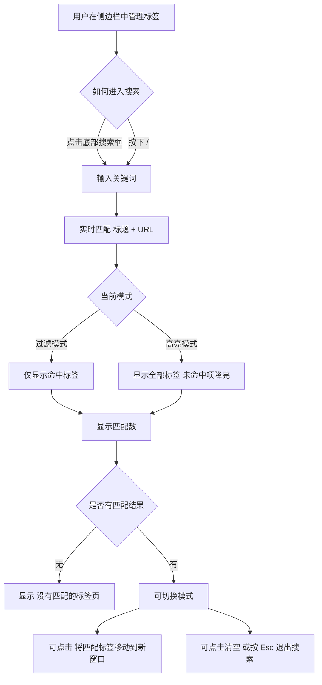

# Chrome 侧边栏标签管理插件 PRD v2.7.0

## 1. 文档概览

| 字段 | 内容 |
| --- | --- |
| 文档类型 | PRD（Product Requirements Document） |
| 产品名称 | Chrome 侧边栏标签管理插件 |
| 版本号 | `2.7.0` |
| 日期 | `2026-04-07` |
| 版本类型 | `MINOR` |
| 文档状态 | 正式版 |
| 对应 MRD | `docs/MRD/chrome-sidepanel-tab-manager-v2.7.0.md` |
| 对应 BRD | `docs/BRD/chrome-sidepanel-tab-manager-v2.7.0.md` |
| 版本口径说明 | 本文描述的是 `v2.7.0` 的需求与交付口径，不等同于“构建产物已正式发版”。 |

---

## 2. Executive Summary

`v2.7.0` 的核心目标，是为现有 Chrome 侧边栏标签管理插件补齐“快速定位 + 立即处理”这条高频操作链路。

在此前版本中，插件已经具备多窗口浏览、分组展示、拖拽、多选、关闭、固定等标签管理能力，但当标签数量继续增加后，用户仍然要依赖滚动浏览去定位某个标签，查找成本高，且找到之后还需要继续手动整理。

因此本版本新增一套**轻量、实时、低打扰**的搜索交互：

- 在侧边栏底部固定区域提供搜索入口
- 支持标题 + URL 实时搜索
- 提供过滤模式与高亮模式两种结果视图
- 显示匹配数量与空结果提示
- 支持 `/` 聚焦搜索、`Esc` 清空搜索
- 支持将当前命中结果一键移动到新窗口

本版本**不是高级搜索器版本**，不引入正则、多条件筛选、搜索历史、保存搜索方案等复杂能力，而是优先解决最常见、最高频、最能提升效率的问题。

---

## 3. 问题定义

### 3.1 谁遇到问题

| 用户类型 | 特征 |
| --- | --- |
| 重度标签用户 | 同时打开几十到数百个标签，跨多个窗口并行工作 |
| 任务并行用户 | 会按项目、主题、上下文拆分浏览器窗口 |
| 信息整理型用户 | 频繁做查找、归类、切换、关闭和搬运标签 |

### 3.2 当前核心问题

| 问题 | 具体表现 | 带来的影响 |
| --- | --- | --- |
| 查找成本高 | 标签过多时只能滚动浏览列表 | 定位慢，打断当前工作流 |
| 找到后处理链路长 | 找到标签后还要手动逐个切换或搬运 | 需要重复操作，效率低 |
| 搜索入口可达性不足 | 若搜索入口不固定，用户会频繁来回滚动 | 搜索本身变得不够顺手 |
| 功能复杂度风险 | 过早引入高级搜索会拉高理解和实现成本 | 偏离“轻量高性能”定位 |

### 3.3 本版本要解决什么

本版本聚焦解决两个问题：

1. **如何更快找到目标标签**
2. **找到后如何立即完成整理动作**

---

## 4. 版本定位

| 项目 | 内容 |
| --- | --- |
| 版本主题 | 侧边栏搜索 / 过滤能力升级 |
| 版本定位 | 从“可浏览的标签管理器”升级为“可搜索、可立即处理的标签管理器” |
| 设计原则 | 轻量、即时、低认知负担、与现有交互兼容 |
| 本次不做 | 高级搜索器、多条件筛选器、搜索历史系统 |

---

## 5. 产品目标与非目标

### 5.1 产品目标

| 编号 | 目标 | 说明 |
| --- | --- | --- |
| G1 | 降低标签定位成本 | 用户可以通过标题或 URL 关键词快速找到目标标签 |
| G2 | 缩短“找到 → 整理”路径 | 搜索结果可直接一键移动到新窗口 |
| G3 | 保持轻量与一致性 | 新能力不破坏现有窗口、分组、拖拽、多选等心智模型 |
| G4 | 提升搜索可达性 | 搜索入口始终可见，且支持键盘快捷调用 |

### 5.2 非目标（Out of Scope）

| 编号 | 非目标 | 说明 |
| --- | --- | --- |
| NG1 | 正则搜索 | 不支持 regex 或复杂查询表达式 |
| NG2 | 多条件组合筛选 | 不支持按窗口 / 分组 / 域名 / 状态做结构化筛选 |
| NG3 | 搜索历史与保存搜索 | 不支持最近搜索、保存筛选方案 |
| NG4 | 富文本关键词高亮 | 不做标题内字符级高亮着色 |
| NG5 | 用户自定义快捷键 | 不提供快捷键配置能力 |

---

## 6. 目标用户与典型场景

### 6.1 目标用户

| 用户角色 | 核心诉求 | 为什么需要 v2.7.0 |
| --- | --- | --- |
| 开发者 / 研究者 | 在大量标签中快速回到某个上下文 | 需要比滚动更快的定位能力 |
| 运营 / 内容整理用户 | 搜索出一批相关页面并集中处理 | 需要搜索后直接移动到新窗口 |
| 重度浏览器用户 | 长时间停留在侧边栏进行管理 | 需要固定搜索入口与键盘友好交互 |

### 6.2 典型场景

| 场景 | 用户动作 | 期望结果 |
| --- | --- | --- |
| 快速定位某个页面 | 输入标题关键词或 URL 片段 | 列表即时收敛到相关标签 |
| 保留上下文继续搜索 | 不希望完全隐藏其他标签 | 切换到高亮模式，保留全局视图 |
| 集中处理一批结果 | 搜索出相关标签后准备统一整理 | 一键将命中标签移动到新窗口 |
| 键盘优先操作 | 不想每次都用鼠标点输入框 | `/` 聚焦、`Esc` 清空，流程顺滑 |

---

## 7. 解决方案总览

### 7.1 核心思路

围绕“搜索”构建一条最短交互链路：

进入搜索 → 输入关键词 → 查看结果 → 切换模式 → 清空 / 转移结果。

### 7.2 功能流程图



### 7.3 界面示意图（ASCII）

```text
┌──────────────────────────────────────┐
│ 顶部工具栏                           │
│ [刷新] [展开/折叠] [批量操作...]     │
├──────────────────────────────────────┤
│ 窗口 1                               │
│   标签 A                             │
│   标签 B                             │
│ 窗口 2                               │
│   分组 X                             │
│   标签 C                             │
│   标签 D                             │
│                                      │
│   ... 列表区域可滚动 ...             │
├──────────────────────────────────────┤
│ [搜索输入框______________] [数量]    │
│ [清除] [过滤/高亮切换] [移到新窗口]  │
│ ↑ 底部固定区域，不随列表滚动         │
└──────────────────────────────────────┘
```

### 7.4 设计原则

| 原则 | 说明 |
| --- | --- |
| 固定可达 | 搜索区始终位于底部固定区域，不随列表滚动消失 |
| 即时反馈 | 输入后立即反映结果，不增加额外提交动作 |
| 结果即操作 | 搜索结果不是“只读信息”，而是可立即处理的操作入口 |
| 最小充分 | 优先满足高频需求，不扩展为复杂搜索系统 |

---

## 8. 功能需求明细

### 8.1 功能清单

| 编号 | 功能模块 | 需求描述 | 优先级 |
| --- | --- | --- | --- |
| FR-01 | 搜索入口 | 在侧边栏底部提供固定搜索区 | P0 |
| FR-02 | 实时搜索 | 支持按标题 + URL 做实时搜索 | P0 |
| FR-03 | 大小写处理 | 搜索匹配不区分大小写 | P0 |
| FR-04 | 过滤模式 | 默认使用过滤模式，仅显示命中结果 | P0 |
| FR-05 | 高亮模式 | 支持切换到高亮模式，保留全部标签并降亮未命中项 | P0 |
| FR-06 | 匹配数量 | 搜索激活后显示“X 个匹配” | P0 |
| FR-07 | 空结果提示 | 无命中时显示“没有匹配的标签页” | P0 |
| FR-08 | 清空搜索 | 支持通过清除按钮快速清空搜索 | P0 |
| FR-09 | 键盘聚焦 | 在非输入态下按 `/` 聚焦搜索框 | P0 |
| FR-10 | 键盘退出 | 在输入态按 `Esc` 清空搜索并退出输入焦点；在非输入态按 `Esc` 清空当前搜索 | P0 |
| FR-11 | 搜后整理 | 可将当前命中结果一键移动到新窗口 | P0 |
| FR-12 | 状态约束 | 无匹配结果时，“移动到新窗口”按钮不可执行 | P1 |
| FR-13 | 图标提示 | 清除、模式切换、移动到新窗口按钮提供 tooltip | P1 |
| FR-14 | 兼容现有交互 | 不破坏多选、拖拽、关闭、固定、分组、窗口折叠等既有能力 | P0 |

### 8.2 搜索模式定义

| 模式 | 定义 | 用户价值 | 默认值 |
| --- | --- | --- | --- |
| 过滤模式 | 仅保留命中标签，隐藏未命中项 | 快速收敛结果，适合高效定位 | 是 |
| 高亮模式 | 保留全部标签，未命中项降亮显示 | 适合需要保留上下文时使用 | 否 |

### 8.3 交互规则

| 交互场景 | 触发条件 | 系统行为 |
| --- | --- | --- |
| 进入搜索 | 点击搜索框或按 `/` | 搜索框获得焦点 |
| 输入关键词 | 用户输入任意字符 | 实时更新搜索结果 |
| 清除搜索 | 点击清除按钮 | 清空关键词，退出搜索结果态 |
| 输入态按 `Esc` | 焦点在输入框内 | 清空关键词，并移除输入焦点 |
| 非输入态按 `Esc` | 当前存在搜索关键词 | 清空关键词 |
| 切换模式 | 点击模式切换按钮 | 在过滤 / 高亮模式间切换 |
| 无结果 | 当前关键词无匹配标签 | 展示空结果文案 |
| 执行移动 | 点击“移动到新窗口” | 将命中标签移动到新建窗口，并清空搜索 |

---

## 9. 用户故事（User Stories）

### Epic

作为一个经常同时打开大量标签页的 Chrome 用户，我希望在侧边栏里快速搜索已打开的标签，并在找到结果后直接整理这些标签，以便减少滚动查找和重复操作带来的时间损耗。

### 用户故事

1. 作为用户，我希望通过标题关键词快速找到某个已经打开的页面。
2. 作为用户，我希望也能通过 URL 片段定位页面，而不是只靠标题。
3. 作为用户，我希望默认只看到命中的标签，减少视觉干扰。
4. 作为用户，我希望在需要保留上下文时，可以切到高亮模式而不是完全过滤掉其他标签。
5. 作为用户，我希望一旦找到目标结果，就能直接把这些结果移动到新窗口中继续处理。
6. 作为用户，我希望搜索框始终可见，而不是跟着列表滚动消失。
7. 作为用户，我希望能用键盘 `/` 快速进入搜索，用 `Esc` 快速退出搜索。

---

## 10. 验收标准

### 10.1 功能验收

| 编号 | 验收项 | 标准 |
| --- | --- | --- |
| AC-01 | 搜索入口位置 | 搜索区位于侧边栏底部固定区域，不随列表滚动 |
| AC-02 | 搜索范围 | 搜索必须覆盖标签标题与 URL |
| AC-03 | 搜索刷新 | 输入关键词后，结果应即时刷新 |
| AC-04 | 默认模式 | 初始搜索结果使用过滤模式 |
| AC-05 | 模式切换 | 用户可切换过滤模式与高亮模式 |
| AC-06 | 匹配数展示 | 搜索激活后必须显示匹配数量 |
| AC-07 | 空结果反馈 | 无结果时展示“没有匹配的标签页” |
| AC-08 | 键盘聚焦 | `/` 可在非输入态下聚焦搜索框 |
| AC-09 | 键盘清空 | `Esc` 可按规则清空当前搜索 |
| AC-10 | 搜后移动 | 点击按钮后，命中标签会被移动到新窗口 |
| AC-11 | 按钮状态 | 无匹配时移动按钮不可执行 |
| AC-12 | 提示信息 | 搜索区关键按钮均具备 tooltip |

### 10.2 兼容性验收

| 编号 | 验收项 | 标准 |
| --- | --- | --- |
| CC-01 | 多窗口兼容 | 搜索结果可跨窗口生效 |
| CC-02 | 分组兼容 | 搜索态不破坏现有分组展示逻辑 |
| CC-03 | 关闭兼容 | 搜索态下关闭标签的既有行为不回退 |
| CC-04 | 拖拽兼容 | 搜索能力不引入拖拽行为回归 |
| CC-05 | 多选兼容 | 搜索能力不破坏现有多选相关能力 |

### 10.3 非功能验收

| 维度 | 验收标准 |
| --- | --- |
| 可理解性 | 用户能够清晰理解当前处于过滤模式还是高亮模式 |
| 可恢复性 | 用户能够迅速清空搜索并返回普通浏览态 |
| 一致性 | 搜索能力与现有侧边栏交互风格保持统一 |
| 轻量性 | 不引入与本次目标无关的复杂筛选配置 |

---

## 11. 影响范围

| 模块 | 文件 | 影响说明 |
| --- | --- | --- |
| 搜索状态与命令拼装 | `src/sidepanel/App.tsx` | 管理搜索词、模式、快捷键、匹配数与结果操作 |
| 搜索栏组件 | `src/sidepanel/SearchBar.tsx` | 承载输入框、图标按钮、tooltip 与交互反馈 |
| 搜索匹配逻辑 | `src/shared/domain/selectors.ts` | 负责过滤 / 高亮模式下的结果选择逻辑 |
| 共享类型 | `src/shared/types.ts` | 定义搜索模式、命令类型等共享结构 |
| 后台命令执行 | `src/background/commandExecutor.ts` | 执行“移动到新窗口”命令 |
| 列表渲染 | `src/sidepanel/components/VirtualizedWindowList.tsx` | 搜索态下处理空结果和展示变化 |
| 行级展示 | `src/sidepanel/components/listRows.tsx` | 高亮模式下处理降亮样式 |
| 单元测试 | `tests/commandExecutor.test.ts` | 校验移动到新窗口的后台执行逻辑 |
| E2E 测试 | `tests/e2e/sidepanel.spec.ts` | 校验侧边栏与新窗口移动链路 |

---

## 12. 依赖、约束与风险

### 12.1 依赖

| 依赖项 | 说明 |
| --- | --- |
| Chrome tabs / windows API | 搜索结果移动到新窗口依赖原生窗口与标签操作能力 |
| 现有侧边栏列表模型 | 搜索结果建立在当前窗口 / 分组 / 标签结构之上 |
| 现有测试体系 | 依赖单元测试与 E2E 对关键能力进行核对 |

### 12.2 约束

| 约束 | 说明 |
| --- | --- |
| 轻量优先 | 不将本版本扩展成复杂高级搜索系统 |
| 真实实现对齐 | 文档只描述当前代码和测试可支持的能力 |
| 兼容既有能力 | 不因新增搜索而重构或破坏原有交互主路径 |

### 12.3 风险与缓解

| 风险 | 表现 | 缓解方式 |
| --- | --- | --- |
| 用户期待过高 | 用户可能以为这是“高级搜索器” | 在 PRD 中明确非目标与边界 |
| 搜索态影响列表理解 | 高亮与过滤两种模式可能让用户混淆 | 通过模式图标与 tooltip 强化理解 |
| 文档和发版状态错位 | 文档版本与构建版本可能不同步 | 明确使用需求 / 交付口径描述 |

---

## 13. 验证策略

### 13.1 自动化验证

| 类型 | 覆盖目标 |
| --- | --- |
| 单元测试 | “移动到新窗口”命令的执行正确性 |
| E2E 测试 | 侧边栏内触发窗口迁移后的整体行为链路 |

### 13.2 手工验证 Checklist

- [ ] 打开多个窗口与多个标签后，底部始终能看到搜索区
- [ ] 输入标题关键词时，结果即时刷新
- [ ] 输入 URL 片段时，结果即时刷新
- [ ] 默认进入过滤模式，仅显示命中项
- [ ] 切换到高亮模式后，未命中项降亮但仍保留
- [ ] 搜索时显示匹配数量
- [ ] 无结果时显示空结果提示
- [ ] 按 `/` 可以聚焦搜索框
- [ ] 按 `Esc` 可以按规则清空搜索
- [ ] 有匹配时可将结果移动到新窗口
- [ ] 无匹配时移动按钮不可执行
- [ ] 搜索区各按钮 tooltip 正常显示

---

## 14. 版本结论

`v2.7.0` 不是一个“功能堆叠版本”，而是一个把**查找效率**真正补齐的关键版本。

它通过一套足够轻量、可立即上手、与现有工作流兼容的搜索交互，让侧边栏从“能看、能点、能整理”进一步升级为“能快速找到并立即处理”。这会显著提升插件在高标签密度场景下的真实使用价值。

---

## 15. 修改记录

| 版本号 | 日期 | 修改内容 | 修改原因 | 影响范围 | 关联任务 / PR |
| --- | --- | --- | --- | --- | --- |
| 2.7.0 | 2026-04-07 | 新增底部固定搜索区、实时搜索、过滤 / 高亮模式、匹配数、空结果提示、快捷键与结果移动到新窗口能力。 | 降低高标签场景下的定位与整理成本。 | 搜索交互、列表展示、后台命令、测试。 | 侧边栏搜索 / 过滤功能与搜索结果转新窗口 |
